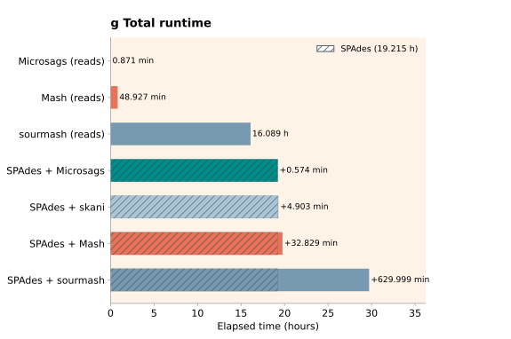
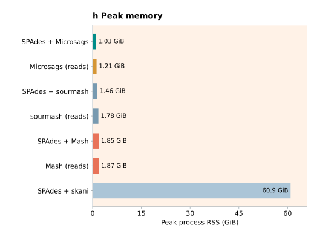
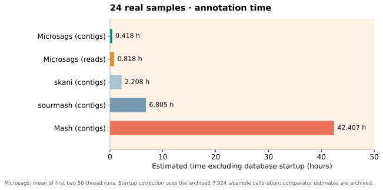
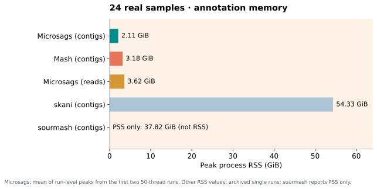

# Performance

These four plots show annotation time and memory for 5,000 simulated SAGs and
24 real samples. The Microsags values are the arithmetic mean of the first two
completed runs. The third simulation run is retained in the source record but
excluded from this display because of higher shared-server load.

## Simulated SAGs · 20 requested threads

The reads routes start from FASTQ. Every contigs route includes the **same
archived SPAdes assembly stage**, shown by the hatched part of its time bar.
The legend gives the shared SPAdes time once. The solid bar end and its dot
mark the subsequent step; each contigs bar labels its minutes and total hours.
The Microsags reads and contigs runs used the same 113,104-reference index.
The simulated chart uses recorded full wall times; a matched, standalone
database-startup correction was not measured for every route.

The SPAdes and other archived comparator times sum stages or per-SAG times,
whereas Microsags annotation is one batch wall time. This is a descriptive
workflow comparison, **not** a matched head-to-head speed ranking.

## Real data · 24 samples · 50 requested threads

These are annotation runs only; their contigs inputs were already assembled.
The time plot excludes estimated database startup. For Microsags, the first
two full-wall totals were averaged and the archived 7.92376-second-per-sample
startup calibration was subtracted. The other methods retain their archived
startup-adjusted estimates. This calibration predates the latest Microsags
scheduling changes, so the adjusted totals are estimates rather than newly
measured core-only runtimes.

Microsags memory is the mean of each run's maximum sampled process RSS across
24 samples. The other RSS values are archived single-run peaks. Sourmash has
an aggregate PSS measurement, not a comparable process RSS; the memory plot
labels it separately without an RSS bar.

The [source tables and plotting scripts](https://github.com/fuyucheng514-tech/cellbit/tree/main/benchmarks)
are included in the repository. These plots measure computational cost, not
species-assignment accuracy. Shared-server load and the different measurement
boundaries should be considered before making speed claims.
